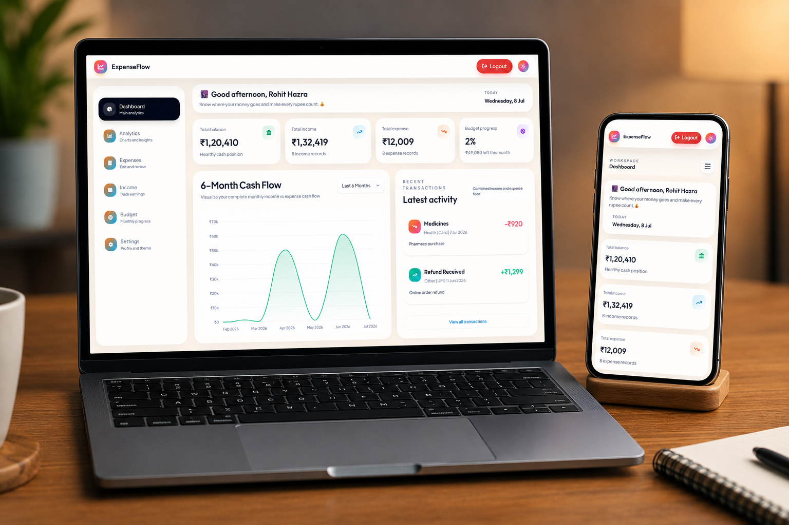
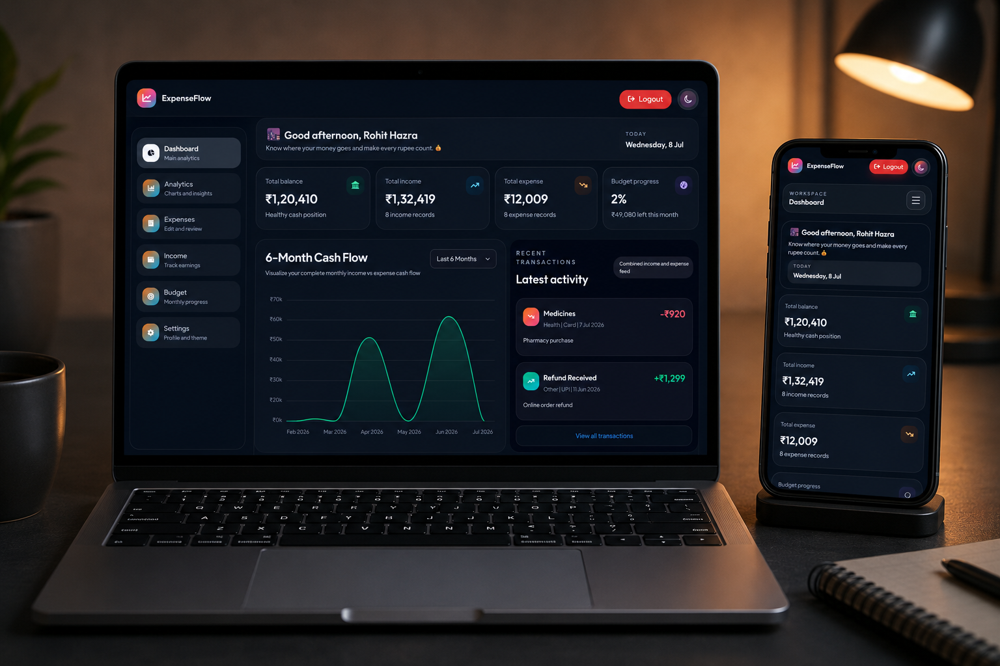
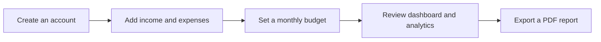

# ExpenseFlow

> **Track every rupee. Build better financial habits.**

ExpenseFlow is a polished, full-stack personal finance dashboard for recording income, managing expenses, setting a monthly budget, and turning day-to-day transactions into useful financial insight.

<p align="center">
  
  
</p>

<p align="center">
  <a href="#-what-you-can-do">Features</a> ·
  <a href="#-quick-start">Quick start</a> ·
  <a href="#-api-at-a-glance">API</a> ·
  <a href="#-project-structure">Structure</a>
</p>

## ✨ What you can do

| Area | Included |
| --- | --- |
| **Dashboard** | See total income, total expenses, current balance, recent activity, and budget progress at a glance. |
| **Expense tracking** | Add, edit, delete, search, and filter expenses by title, category, and payment method. |
| **Income tracking** | Organize salary, freelance, business, interest, gift, and other income sources. |
| **Budget planning** | Set a monthly budget and monitor spending, remaining funds, and overspending. |
| **Analytics** | Explore income-versus-expense trends and expense breakdowns by category. |
| **Reports** | Download an executive PDF report with summaries, category analysis, and transaction tables for a selected period. |
| **Account settings** | Update your profile, change your password, and sign out securely. |
| **Personalization** | Switch between light and dark themes; preferences persist in the browser. |

### A simple flow



<details>
<summary><strong>See the supported transaction fields</strong></summary>

Every income and expense record includes:

- Title and amount
- Category
- Transaction type: UPI, Cash, Card, or Bank Transfer
- Date
- Optional description

Default expense categories are Food, Travel, Shopping, Bills, Health, Entertainment, and Other. Default income categories are Salary, Freelance, Business, Interest, Gift, and Other.

</details>

## 🧱 Tech stack

**Frontend**

- React 19 with React Router
- Vite
- Tailwind CSS 4
- Axios for API requests
- Chart.js for interactive charts
- pdfmake for browser-generated PDF reports
- React Hot Toast for feedback messages

**Backend**

- Node.js and Express 5
- MongoDB with Mongoose
- JWT authentication
- bcryptjs password hashing
- CORS and dotenv configuration

## 🚀 Quick start

### Prerequisites

- Node.js 18+ and npm
- A MongoDB database, local or hosted

### 1. Install dependencies

From the project root:

```bash
npm install
npm install --prefix frontend
npm install --prefix backend
```

### 2. Configure the backend

Create `backend/.env`:

```env
MONGO_URI=mongodb://127.0.0.1:27017/expenseflow
JWT_SECRET=replace-this-with-a-long-random-secret
PORT=5000
CLIENT_URL=http://localhost:5173
```

### 3. Configure the frontend (optional)

The frontend defaults to `http://localhost:5000/api`. To use another API URL, create `frontend/.env`:

```env
VITE_API_URL=http://localhost:5000/api
```

### 4. Start the app

Run both services together:

```bash
npm run dev
```

Then open [http://localhost:5173](http://localhost:5173).

You can also run the services separately:

```bash
npm run dev:backend
npm run dev:frontend
```

> The backend connects to MongoDB before it starts listening. If `MONGO_URI` is missing or invalid, the API will not start.

## 📜 Available scripts

| Command | Purpose |
| --- | --- |
| `npm run dev` | Start frontend and backend together |
| `npm run dev:frontend` | Start the Vite development server |
| `npm run dev:backend` | Start the Express server with Nodemon |
| `npm run build` | Create a production frontend build |
| `npm run lint` | Run the frontend ESLint checks |

## 🔌 API at a glance

All protected routes require an `Authorization: Bearer <token>` header.

| Method | Endpoint | Purpose | Auth |
| --- | --- | --- | :---: |
| `GET` | `/api/health` | Check whether the API is running | No |
| `POST` | `/api/auth/register` | Create an account | No |
| `POST` | `/api/auth/login` | Sign in and receive a JWT | No |
| `GET` | `/api/auth/me` | Restore the current session | Yes |
| `PATCH` | `/api/auth/me` | Update the profile name | Yes |
| `PATCH` | `/api/auth/me/password` | Change the password | Yes |
| `GET` | `/api/expenses` | List the signed-in user’s expenses | Yes |
| `POST` / `PUT` / `DELETE` | `/api/expenses` | Create, update, or delete an expense | Yes |
| `GET` | `/api/income` | List the signed-in user’s income | Yes |
| `POST` / `PUT` / `DELETE` | `/api/income` | Create, update, or delete income | Yes |
| `GET` / `PUT` | `/api/budget` | Read or update the monthly budget | Yes |

## 🗂️ Project structure

```text
ExpenseFlow/
├─ frontend/
│  ├─ public/                 # Favicon and public assets
│  └─ src/
│     ├─ components/          # Shared UI, forms, navigation, and modals
│     ├─ pages/               # Landing, auth, and dashboard screens
│     ├─ utils/               # PDF report generation
│     ├─ lib/api.js           # Axios client and JWT header handling
│     └─ index.css            # Tailwind entry point and theme tokens
├─ backend/
│  └─ src/
│     ├─ config/              # MongoDB connection
│     ├─ controllers/         # Auth, income, expense, and budget logic
│     ├─ middleware/          # JWT authentication middleware
│     ├─ models/              # Mongoose schemas
│     ├─ routes/              # REST API routes
│     └─ server.js            # API bootstrap
├─ package.json               # Workspace scripts
└─ README.md
```

## 🔐 Authentication and data flow

1. A user registers or logs in through the React client.
2. The API returns a JWT valid for seven days.
3. The client stores the token locally and attaches it to protected Axios requests.
4. The backend validates the token and scopes every income, expense, and budget operation to the authenticated user.
5. Passwords are hashed with bcryptjs and are never returned in API responses.

## 🧪 Before opening a pull request

```bash
npm run lint
npm run build
```

When testing manually, verify registration, login/session restore, CRUD operations for both transaction types, budget updates, analytics with empty and populated data, theme persistence, and PDF downloads.

## 🛣️ Possible next steps

- **AI-Powered Receipt Capture** — Upload receipt images and automatically extract key expense details such as merchant, amount, date, category, and payment method, with a review step before saving.
- **Automated Testing** — Add comprehensive API and component tests to improve reliability and maintainability.
- **Advanced Data Filtering** — Introduce server-side pagination and richer date-range filtering for faster and more flexible expense tracking.
- **Improved Chart Integration** — Move Chart.js from the CDN to the frontend dependency graph for cleaner and more maintainable integration.
- **Production-Ready Deployment** — Add deployment configuration, environment examples, and production setup guidance.
- **Recurring Transactions & CSV Export** — Support recurring income and expenses while allowing users to export their financial data as CSV.

---

<p align="center">Built with React, Express, MongoDB, and a little financial clarity.</p>
